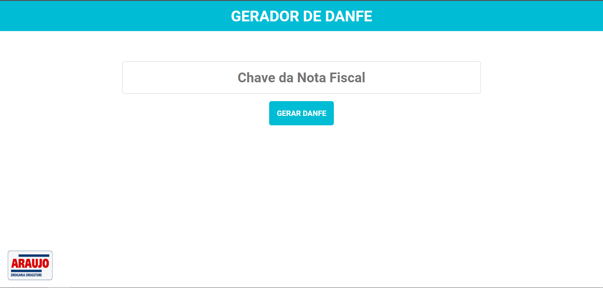

# DANFE Printer 
Projeto desenvolvido utilizando Java 8 e Spring Boot para geração de DANFE.

## Como funciona?
Para pedidos com emissão de nota fiscal no SAP.
O Danfe printer busca o XML da NF no web service do SAP e gera o PDF do DANFE.

## Como usar?

#### ENDPOINT REST
    `GET /danfe-printer/rest/print/by-nfe-key/{CHAVE-NOTA-FISCAL}`

    O Endpoint retorna o DANFE no formato "application/pdf"

#### PÁGINA WEB
Uma página WEB está disponível na rota base da aplicação `/danfe-printer`

